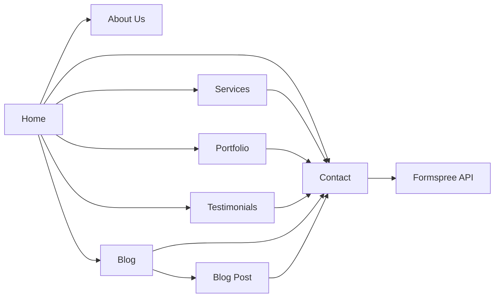
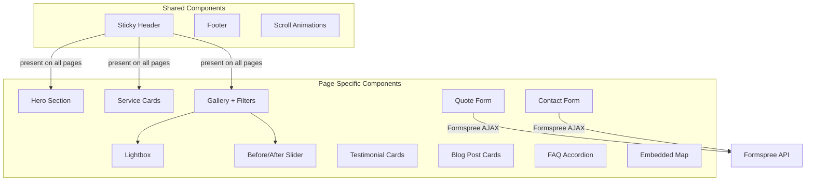

# Design Document: Pilkington Floors Portfolio Website

## Overview

This design describes a static portfolio website for Pilkington Floors, a residential and commercial flooring company specialising in Amtico. The site is built with vanilla HTML5, CSS3, and JavaScript — no frameworks, no build tools, no server-side runtime — and is deployed directly to GitHub Pages.

The architecture follows a multi-page static site pattern with shared CSS and JavaScript modules. Each page (Home, About, Services, Portfolio, Testimonials, Blog, Contact) is a standalone HTML file that includes common header/footer partials via JavaScript injection. Form submissions are handled by Formspree, a third-party service that accepts HTML form POSTs and forwards them as email.

### Key Design Decisions

| Decision | Choice | Rationale |
|---|---|---|
| Framework | None (vanilla HTML/CSS/JS) | GitHub Pages constraint; no build step needed; simplest deployment |
| CSS approach | Single stylesheet with CSS custom properties | Consistent theming from logo colours; no preprocessor needed |
| Lightbox | Custom vanilla JS implementation | Avoids external dependency; full control over accessibility (focus trap, keyboard nav) |
| Before/After slider | Custom vanilla JS implementation | Small scope; avoids pulling in a library for one component |
| Form handling | Formspree | Free tier supports static sites; no server code; simple HTML form action |
| Image optimisation | Manual pre-optimisation + lazy loading | No build pipeline; use `loading="lazy"` and appropriately sized images |
| Structured data | JSON-LD in `<script>` tags | Recommended by Google; cleanly separated from HTML markup |
| Animations | CSS transitions + Intersection Observer | Lightweight scroll-triggered animations without a library |

### Research Summary

- **Formspree** works by setting the form's `action` attribute to `https://formspree.io/f/{FORM_ID}`. Submissions are forwarded to a configured email. The free tier allows 50 submissions/month, which is suitable for a small business portfolio site. No JavaScript is required for basic operation, though AJAX submission is supported for a better UX (no page redirect). [Source: formspree.io](https://formspree.io/html)
- **Before/After sliders** can be implemented in ~60 lines of vanilla JS using pointer events for mouse and touch support. The pattern involves two overlapping images with a `clip-path` or `overflow: hidden` on the top image, adjusted by a draggable divider. [Source: various GitHub repos](https://github.com/VincentTV/before-after-slider)
- **Schema.org LocalBusiness** structured data should use the `HomeAndConstructionBusiness` subtype for a flooring company. Key properties include `name`, `description`, `address`, `telephone`, `url`, `image`, `areaServed`, and `serviceType`. JSON-LD format is preferred. [Source: schema.org, schemaapp.com](https://www.schemaapp.com/schema-markup/how-to-do-schema-markup-for-local-business/)

---

## Architecture

### Site Structure

```
pilkingtonfloors/
├── index.html              # Home page
├── about.html              # About Us page
├── services.html           # Services page
├── portfolio.html          # Portfolio / Gallery page
├── testimonials.html       # Testimonials page
├── blog.html               # Blog listing page
├── blog/
│   ├── post-1.html         # Individual blog post
│   └── post-2.html         # Individual blog post
├── contact.html            # Contact page with Quote Form
├── css/
│   └── styles.css          # Single stylesheet with CSS custom properties
├── js/
│   ├── main.js             # Shared: header, mobile menu, scroll animations
│   ├── gallery.js          # Portfolio: filtering, lightbox
│   ├── slider.js           # Before/After slider component
│   └── form.js             # Form validation and Formspree AJAX submission
├── images/
│   ├── logo.png            # Company logo (source for style guide)
│   ├── *.jpeg              # Project photos (12 images)
│   └── optimised/          # Resized/compressed versions for web
├── sitemap.xml             # SEO sitemap
├── robots.txt              # Search engine crawl directives
└── README.md               # Deployment instructions
```

### Page Flow Diagram



All pages share the Sticky Header with navigation links and the "Get a Free Quote" CTA button. The CTA on every page funnels visitors toward the Contact page Quote Form.

### Component Architecture



---

## Components and Interfaces

### 1. Sticky Header (`main.js`)

**Responsibility:** Persistent navigation bar with logo, nav links, CTA button, and mobile hamburger menu.

**Behaviour:**
- Renders into a `<header>` element with `position: sticky; top: 0`
- Contains: logo image, nav links (Home, About Us, Services, Portfolio, Testimonials, Blog, Contact), "Get a Free Quote" button
- At ≤768px viewport width, nav links collapse behind a hamburger icon
- Clicking hamburger toggles a slide-in mobile menu panel
- Clicking a nav link in mobile mode closes the menu
- Adds a subtle box-shadow on scroll (detected via `scroll` event or Intersection Observer on a sentinel element)

**Interface:**
```javascript
// main.js
function initStickyHeader() { /* attaches event listeners */ }
function toggleMobileMenu() { /* opens/closes mobile nav */ }
function closeMobileMenu() { /* closes mobile nav */ }
```

### 2. Gallery with Filtering (`gallery.js`)

**Responsibility:** Displays project images in a responsive grid with category filtering and animated transitions.

**Behaviour:**
- Reads project data from a JavaScript array (defined in `gallery.js` or a `data/projects.js` file)
- Each project has: `id`, `src`, `thumb`, `alt`, `category[]`, `title`, `description`
- Filter buttons rendered for: All, Hardwood, Laminate, Vinyl, Amtico, Carpet, Commercial, Residential
- Clicking a filter hides non-matching items with a CSS fade/scale transition
- Thumbnails show a hover overlay with project title and category
- Clicking a thumbnail opens the Lightbox

**Interface:**
```javascript
// gallery.js
const projects = [
  { id: 1, src: 'images/project-1.jpeg', thumb: 'images/thumbs/project-1.jpeg',
    alt: 'Amtico herringbone floor in living room', category: ['amtico', 'residential'],
    title: 'Herringbone Living Room', description: 'Amtico Signature herringbone...' },
  // ...
];

function initGallery() { /* renders grid, attaches filter listeners */ }
function filterGallery(category) { /* shows/hides items with animation */ }
function openLightbox(projectId) { /* opens lightbox for given project */ }
```

### 3. Lightbox (`gallery.js`)

**Responsibility:** Full-screen image viewer with navigation, keyboard support, and accessibility.

**Behaviour:**
- Opens as a modal overlay (`<div role="dialog" aria-modal="true">`)
- Displays full-size image with next/previous navigation arrows
- Keyboard: Escape closes, Left/Right arrows navigate, Tab is trapped within modal
- Clicking outside the image area closes the lightbox
- Focus is trapped inside the lightbox while open; on close, focus returns to the triggering thumbnail
- Includes close button with `aria-label="Close lightbox"`

**Interface:**
```javascript
// gallery.js (lightbox functions)
function openLightbox(projectId) { /* creates overlay, traps focus */ }
function closeLightbox() { /* removes overlay, restores focus */ }
function navigateLightbox(direction) { /* +1 or -1 through filtered images */ }
```

### 4. Before/After Slider (`slider.js`)

**Responsibility:** Interactive image comparison component with drag and touch support.

**Behaviour:**
- Takes two images (before, after) and renders them overlapping
- A vertical divider line with a drag handle sits between them
- Dragging the handle (mouse or touch) adjusts a CSS `clip-path` on the top image
- Labels "Before" and "After" are positioned on their respective sides
- Works with both `pointerdown`/`pointermove`/`pointerup` events for unified mouse+touch handling

**Interface:**
```javascript
// slider.js
function initBeforeAfterSliders() {
  // finds all elements with [data-before-after] attribute
  // initialises drag behaviour on each
}
```

**HTML usage:**
```html
<div class="before-after-slider" data-before-after>
  
  
  <div class="slider-handle" aria-label="Drag to compare before and after"></div>
  <span class="label-before">Before</span>
  <span class="label-after">After</span>
</div>
```

### 5. Quote Form & Contact Form (`form.js`)

**Responsibility:** Client-side form validation and AJAX submission to Formspree.

**Behaviour:**
- Quote Form fields: name (required), email (required), phone (optional), flooring type (select, required), project description (textarea, required)
- Contact Form fields: name (required), email (required), message (required)
- Validates on submit: checks required fields are non-empty, validates email format with regex
- Displays inline error messages next to invalid fields
- On valid submission, sends via `fetch()` POST to Formspree endpoint
- On success, shows a confirmation message and resets the form
- On failure, shows an error message asking the visitor to try again or call directly

**Interface:**
```javascript
// form.js
function initForms() { /* attaches submit handlers to all forms */ }
function validateForm(formElement) { /* returns { valid: boolean, errors: Map<fieldName, message> } */ }
function submitForm(formElement, formspreeUrl) { /* AJAX POST, returns Promise */ }
function showValidationErrors(formElement, errors) { /* renders error messages */ }
function clearValidationErrors(formElement) { /* removes error messages */ }
function showConfirmation(formElement) { /* shows success message */ }
```

**Validation rules:**
```javascript
const validationRules = {
  name:        { required: true, message: 'Please enter your name' },
  email:       { required: true, pattern: /^[^\s@]+@[^\s@]+\.[^\s@]+$/, message: 'Please enter a valid email address' },
  phone:       { required: false },
  flooringType:{ required: true, message: 'Please select a flooring type' },
  description: { required: true, message: 'Please describe your project' },
  messageText: { required: true, message: 'Please enter your message' }
};
```

### 6. FAQ Accordion (`main.js`)

**Responsibility:** Expandable question/answer section with single-open behaviour.

**Behaviour:**
- Each FAQ item is a `<details>` element (or a custom accordion using `<button>` + `<div>`)
- Clicking a question expands its answer and collapses any other open answer
- Uses `aria-expanded` and `aria-controls` for accessibility
- Smooth height transition via CSS `max-height` or `grid-template-rows` animation

### 7. Scroll Animations (`main.js`)

**Responsibility:** Fade-in and slide-up effects on elements as they enter the viewport.

**Behaviour:**
- Uses `IntersectionObserver` to detect when elements with `[data-animate]` enter the viewport
- Adds a CSS class (e.g., `.animate-in`) that triggers a CSS transition
- Runs once per element (observer disconnects after triggering)

---

## Data Models

### Project Data

Each portfolio project is represented as a JavaScript object. This data is defined inline in `gallery.js` since there is no backend.

```javascript
/**
 * @typedef {Object} Project
 * @property {number} id - Unique project identifier
 * @property {string} src - Path to full-size image
 * @property {string} thumb - Path to thumbnail image
 * @property {string} alt - Descriptive alt text for the image
 * @property {string[]} category - Array of category tags (e.g., ['amtico', 'residential'])
 * @property {string} title - Project display title
 * @property {string} description - Brief project description
 */
```

### Testimonial Data

```javascript
/**
 * @typedef {Object} Testimonial
 * @property {number} id - Unique testimonial identifier
 * @property {string} name - Reviewer display name
 * @property {number} rating - Star rating (1-5)
 * @property {string} text - Review text content
 * @property {string} [date] - Optional review date (ISO 8601)
 */
```

### Service Data

```javascript
/**
 * @typedef {Object} Service
 * @property {string} id - Unique service identifier (e.g., 'amtico')
 * @property {string} title - Service display name (e.g., 'Amtico Flooring')
 * @property {string} icon - CSS class or SVG reference for the service icon
 * @property {string} description - Brief customer-facing description
 * @property {string} category - 'residential' | 'commercial' | 'both'
 */
```

### Blog Post Data

```javascript
/**
 * @typedef {Object} BlogPost
 * @property {string} slug - URL-friendly identifier (e.g., 'amtico-care-guide')
 * @property {string} title - Post title
 * @property {string} excerpt - Short preview text
 * @property {string} date - Publication date (ISO 8601)
 * @property {string} url - Relative path to the full post HTML file
 */
```

### FAQ Data

```javascript
/**
 * @typedef {Object} FAQItem
 * @property {string} question - The question text
 * @property {string} answer - The answer text (may contain HTML)
 */
```

### Form Submission Payload (Formspree)

The Quote Form submits the following fields via POST:

| Field | Type | Required | Notes |
|---|---|---|---|
| `name` | string | Yes | Visitor's full name |
| `email` | string | Yes | Valid email format |
| `phone` | string | No | UK phone number |
| `flooringType` | string | Yes | Selected from dropdown |
| `description` | string | Yes | Free-text project description |
| `_subject` | string | Auto | Formspree: sets email subject line |
| `_replyto` | string | Auto | Formspree: sets reply-to address |

### Schema.org Structured Data (JSON-LD)

Embedded in the `<head>` of `index.html`:

```json
{
  "@context": "https://schema.org",
  "@type": "HomeAndConstructionBusiness",
  "name": "Pilkington Floors",
  "description": "Residential and commercial flooring specialists. Amtico approved installer.",
  "url": "https://pilkingtonfloors.github.io",
  "image": "images/logo.png",
  "telephone": "+44-XXXX-XXXXXX",
  "address": {
    "@type": "PostalAddress",
    "addressLocality": "...",
    "addressRegion": "...",
    "addressCountry": "GB"
  },
  "areaServed": {
    "@type": "GeoCircle",
    "geoMidpoint": { "@type": "GeoCoordinates", "latitude": "...", "longitude": "..." },
    "geoRadius": "..."
  },
  "serviceType": ["Amtico flooring", "Hardwood flooring", "Laminate flooring", "Vinyl flooring", "Carpet fitting", "Commercial flooring"],
  "sameAs": ["https://www.instagram.com/pilkington_floors/"]
}
```

### CSS Custom Properties (Style Guide)

Derived from the Pilkington Floors logo. Exact values to be extracted during implementation, but the structure is:

```css
:root {
  /* Primary colours — extracted from logo */
  --color-primary: #XXXXXX;       /* Main brand colour from logo */
  --color-primary-dark: #XXXXXX;  /* Darker shade for hover states */
  --color-primary-light: #XXXXXX; /* Lighter tint for backgrounds */

  /* Neutral palette */
  --color-text: #2D2D2D;          /* Body text */
  --color-text-light: #6B6B6B;    /* Secondary text */
  --color-bg: #FFFFFF;            /* Page background */
  --color-bg-alt: #F7F7F7;        /* Alternating section background */
  --color-border: #E0E0E0;        /* Borders and dividers */

  /* Typography */
  --font-heading: 'Inter', sans-serif;
  --font-body: 'Inter', sans-serif;
  --font-size-base: 1rem;         /* 16px */
  --line-height-base: 1.6;

  /* Spacing scale */
  --space-xs: 0.25rem;
  --space-sm: 0.5rem;
  --space-md: 1rem;
  --space-lg: 2rem;
  --space-xl: 4rem;

  /* Component tokens */
  --radius: 8px;
  --shadow-sm: 0 1px 3px rgba(0,0,0,0.08);
  --shadow-md: 0 4px 12px rgba(0,0,0,0.1);
  --shadow-lg: 0 8px 24px rgba(0,0,0,0.12);
  --transition: 0.3s ease;
}
```

---

## Correctness Properties

*A property is a characteristic or behavior that should hold true across all valid executions of a system — essentially, a formal statement about what the system should do. Properties serve as the bridge between human-readable specifications and machine-verifiable correctness guarantees.*

### Property 1: Gallery filter returns only matching projects

*For any* array of projects with arbitrary category tags and *for any* selected filter category, the filtered result should contain only projects whose `category` array includes the selected category, and no project matching the category should be excluded. When the filter is "All", every project should be included.

**Validates: Requirements 5.4, 5.5**

### Property 2: Lightbox navigation stays within bounds

*For any* gallery of N images (N ≥ 1) and *for any* current index, navigating forward should advance to the next image (wrapping to the first image at the end), and navigating backward should move to the previous image (wrapping to the last image at the start). The resulting index should always be in the range [0, N-1].

**Validates: Requirements 6.6**

### Property 3: Before/After slider clip position is proportional

*For any* slider container width W > 0 and *for any* pointer position X, the computed clip percentage should equal `clamp(0, X / W, 1)`. The before image should be clipped to reveal exactly that proportion, and the after image should fill the remainder.

**Validates: Requirements 7.3**

### Property 4: Form validation rejects incomplete required fields

*For any* combination of form field values where at least one required field is empty or contains only whitespace, the `validateForm` function should return `valid: false` and the `errors` map should contain an entry for every required field that is empty/whitespace, and no entry for fields that are correctly filled.

**Validates: Requirements 9.4**

### Property 5: Email validation correctly classifies email formats

*For any* string, the email validation function should accept it if and only if it matches the pattern `^[^\s@]+@[^\s@]+\.[^\s@]+$`. Strings not matching this pattern should be rejected with an appropriate error message.

**Validates: Requirements 9.5**

### Property 6: Blog posts are ordered reverse chronologically

*For any* array of blog posts with date fields, after sorting for display, each post's date should be greater than or equal to the date of the post that follows it. The ordering function should be stable (posts with identical dates maintain their original relative order).

**Validates: Requirements 10.4**

### Property 7: FAQ accordion maintains single-open invariant

*For any* FAQ section with N items (N ≥ 1) and *for any* sequence of item clicks, after each click at most one FAQ answer should be in the expanded state. Specifically, clicking item K should expand item K and collapse all others. Clicking an already-expanded item should collapse it, leaving zero items expanded.

**Validates: Requirements 11.2, 11.3**

### Property 8: Each page has unique meta title and description

*For any* pair of distinct HTML pages in the site, the `<title>` content and the `<meta name="description">` content should both differ between the two pages. No two pages should share the same title or the same description.

**Validates: Requirements 14.2**

### Property 9: All images have non-empty alt text

*For any* `` element on *any* page of the site, the `alt` attribute should be present and contain a non-empty, non-whitespace-only string describing the image content.

**Validates: Requirements 14.4**

### Property 10: All form fields have associated labels

*For any* form input element (`<input>`, `<select>`, `<textarea>`) on *any* page, there should be an associated `<label>` element — either via a matching `for`/`id` pair or by the input being a descendant of the `<label>` element.

**Validates: Requirements 15.4**

### Property 11: All internal asset paths are relative

*For any* asset reference (`src` on ``, `<script>`; `href` on `<link>`, `<a>` pointing to local resources) in *any* HTML file, the path should be relative (not beginning with `/` or `http://`/`https://`), excluding intentional external URLs (Formspree endpoint, Google Maps embed, Instagram link, Google Fonts CDN).

**Validates: Requirements 16.4**

---

## Error Handling

### Form Submission Errors

| Scenario | Handling |
|---|---|
| Required field empty | Inline error message below the field; field border turns red; form does not submit |
| Invalid email format | Inline error message: "Please enter a valid email address" |
| Formspree network error | Display message: "Something went wrong. Please try again or call us directly on [phone]." |
| Formspree rate limit (429) | Display message: "Too many requests. Please wait a moment and try again." |
| Formspree server error (5xx) | Display message: "Our form service is temporarily unavailable. Please email us at [email] or call [phone]." |

### Image Loading Errors

| Scenario | Handling |
|---|---|
| Gallery image fails to load | Display a placeholder with the project title; do not break the grid layout |
| Lightbox image fails to load | Show error text inside the lightbox: "Image could not be loaded" with a close button |
| Before/After slider image fails | Hide the slider component and show a fallback static image or message |

### JavaScript Disabled

The site should be functional without JavaScript in a degraded mode:
- Navigation links work as standard `<a>` tags (no JS needed for page navigation)
- Gallery displays all images without filtering (filters hidden via `<noscript>` or CSS)
- Forms submit via standard HTML form POST to Formspree (works without JS)
- FAQ items use `<details>`/`<summary>` elements for native expand/collapse
- Lightbox and Before/After slider are unavailable; images display inline

### Accessibility Error States

- Focus trap failure in lightbox: if focus escapes, a `focusin` listener on `document` recaptures it
- Missing alt text: build-time linting (or manual review) catches missing alt attributes
- Colour contrast failure: CSS custom properties make it straightforward to adjust colours globally

---

## Testing Strategy

### Overview

Testing follows a dual approach: **example-based unit tests** for specific scenarios and edge cases, and **property-based tests** for universal correctness guarantees. Since this is a static site with vanilla JS, tests focus on the JavaScript logic layer (validation, filtering, navigation, sorting) rather than visual rendering.

### Test Framework

- **Test runner:** [Vitest](https://vitest.dev/) — fast, modern, works with vanilla JS
- **Property-based testing:** [fast-check](https://fast-check.dev/) — mature PBT library for JavaScript
- **DOM testing:** [jsdom](https://github.com/jsdom/jsdom) via Vitest's jsdom environment — simulates browser DOM for component tests

### Property-Based Tests

Each correctness property from the design document is implemented as a single property-based test with a minimum of **100 iterations**.

| Property | Test File | What It Validates |
|---|---|---|
| 1: Gallery filter correctness | `tests/gallery.test.js` | Filtering returns only matching projects |
| 2: Lightbox navigation bounds | `tests/gallery.test.js` | Arrow key navigation stays within valid indices |
| 3: Slider clip position | `tests/slider.test.js` | Clip percentage is proportional to pointer position |
| 4: Required field validation | `tests/form.test.js` | Empty required fields produce correct errors |
| 5: Email format validation | `tests/form.test.js` | Email regex correctly accepts/rejects strings |
| 6: Blog post ordering | `tests/blog.test.js` | Posts sorted in reverse chronological order |
| 7: FAQ single-open invariant | `tests/faq.test.js` | At most one FAQ item expanded at any time |

Each test is tagged with a comment: `// Feature: flooring-portfolio-website, Property N: [description]`

### Example-Based Unit Tests

| Area | Test File | Key Scenarios |
|---|---|---|
| Sticky header | `tests/header.test.js` | Contains logo, all nav links, CTA button; hamburger toggles menu |
| Form validation | `tests/form.test.js` | Specific valid/invalid inputs; phone number optional; confirmation message |
| Gallery | `tests/gallery.test.js` | Specific filter selections; hover overlay content; empty gallery state |
| Lightbox | `tests/gallery.test.js` | Open/close; Escape key; click outside; focus trap and restore |
| Before/After slider | `tests/slider.test.js` | Boundary positions (0%, 100%); label visibility |
| FAQ accordion | `tests/faq.test.js` | Click to expand; click again to collapse; initial state all collapsed |
| Blog sorting | `tests/blog.test.js` | Posts with same date; single post; empty list |

### Integration / Smoke Tests

| Area | Approach |
|---|---|
| Formspree submission | Manual test with real Formspree endpoint; verify email received |
| Lighthouse performance | Run `lighthouse` CLI against deployed site; verify score ≥ 90 |
| WCAG compliance | Run `axe-core` automated audit; manual keyboard navigation test |
| GitHub Pages deployment | Deploy to test repo; verify site loads from root and subdirectory |
| Cross-browser | Manual testing in Chrome, Firefox, Safari, Edge |
| Responsive layout | Manual testing at 320px, 768px, 1024px, 1440px, 2560px breakpoints |

### Static Analysis

| Check | Tool | What It Catches |
|---|---|---|
| HTML validation | [HTMLHint](https://htmlhint.com/) or W3C validator | Invalid markup, missing attributes |
| Alt text presence | Custom script or axe-core | Missing or empty alt attributes |
| Relative paths | Custom script | Absolute paths that break on GitHub Pages |
| Meta tag uniqueness | Custom script | Duplicate titles or descriptions across pages |

### Test Configuration

```javascript
// vitest.config.js
export default {
  test: {
    environment: 'jsdom',
    include: ['tests/**/*.test.js'],
  }
};
```

Property tests use fast-check with `{ numRuns: 100 }` minimum per property.
